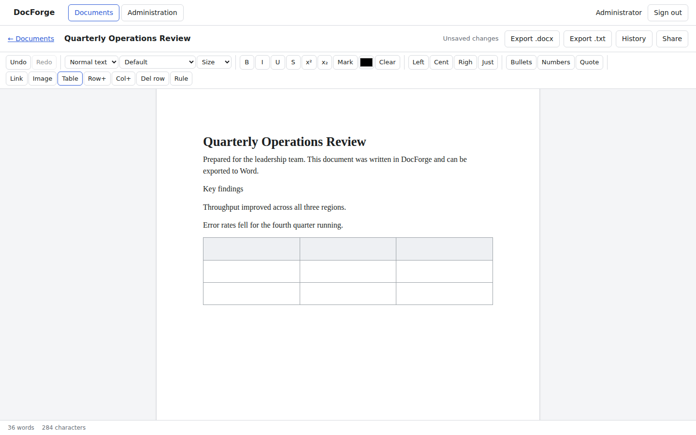
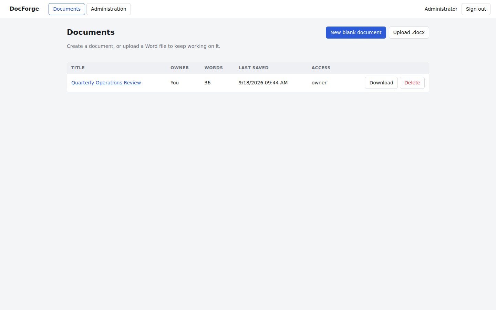
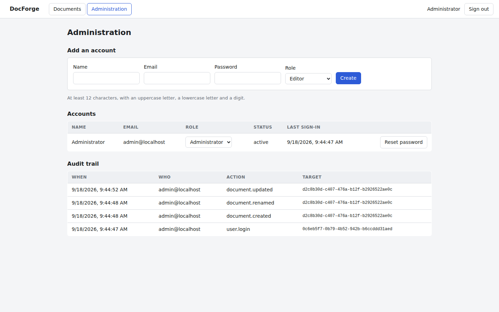
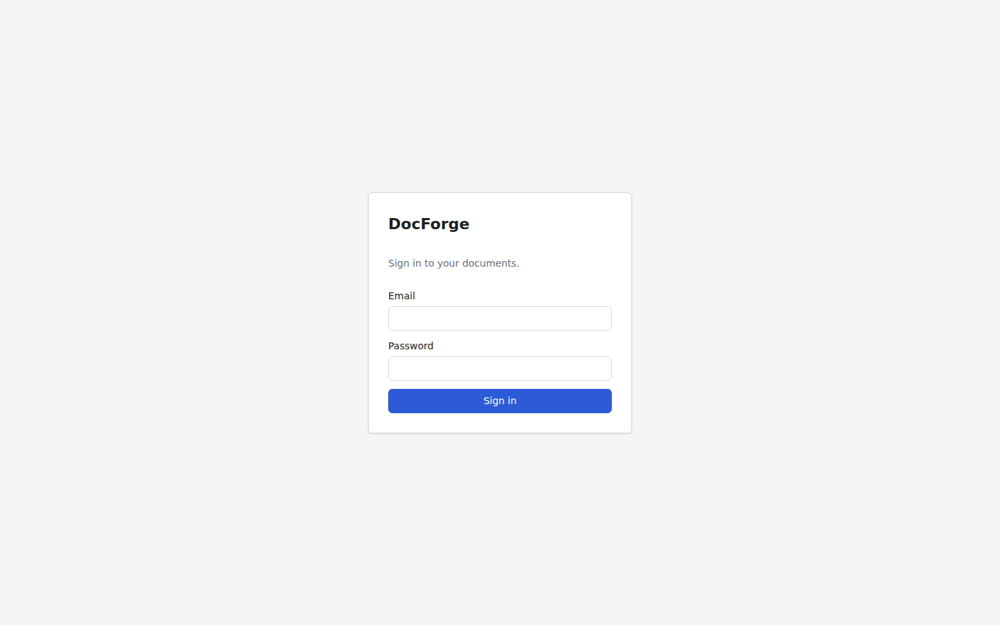

# DocForge

A collaborative, browser-based word processor for air-gapped deployment.

- **Air gapped.** No CDN, no web fonts, no telemetry. Three checks enforce it, at
  three layers: the browser bundle is audited for remote URLs, the page is
  watched in a real browser for any request off its own origin, and the server
  runs behind a probe that fails the run if it dials anything beyond loopback.
  The last two are themselves verified against deliberate violations.
- **Two targets.** A Linux server for a team, and a single Windows laptop that
  runs the same stack locally.
- **Enterprise shaped.** Roles, per-document sharing, version history, an
  append-only audit trail, session revocation and optimistic concurrency.
- **Word compatible.** Upload a `.docx`, edit it, export it back.
- **Clean licensing.** MIT, BSD, Apache-2.0 and SIL OFL only. No GPL or AGPL.

## What works today

A complete portal. Sign in, manage accounts, start a document from scratch or
upload a Word file, edit it with a formatting ribbon, and export it again.

| Area | Included |
|---|---|
| Accounts | Seed administrator on first start, sign in and out, change password, administrator-created accounts, password reset, disable and enable |
| Roles | Administrator, editor, viewer |
| Sharing | Per-document view or edit grants, owner-only control |
| Documents | Create blank, upload `.docx`, autosave, rename, delete |
| Editing | Headings, bold, italic, underline, strikethrough, superscript, subscript, highlight, colour, font family and size, alignment, lists, block quotes, links, images, tables, horizontal rules, undo and redo, live word count |
| History | Every save kept as a version, with restore |
| Export | `.docx` and plain text, as a browser download |
| Safety | Optimistic concurrency, structural validation of every save, audit trail, rate-limited sign-in, content security policy |

Real-time co-editing is designed but not built. The document model and the
storage layer were chosen so that a CRDT layer drops in without reshaping them.
See the architecture document.

## Screenshots

Captured by `scripts/ui-walkthrough.mjs`, which drives the built portal in a
real browser.

| | |
|---|---|
|  |  |
| The editor, with the formatting ribbon and a table | The document list |
|  |  |
| Accounts, roles and the audit trail | Sign in |

## Try it

```
npm ci
npm run verify
DOCFORGE_ADMIN_PASSWORD='Choose-A-Strong-One-1' npm start
```

Open `http://127.0.0.1:8080` and sign in as `admin@localhost`.

For development with hot reload, run the two sides separately:

```
npm run dev:server     # http://127.0.0.1:8080
npm run dev:web        # http://127.0.0.1:5173, proxies the API
```

## Commands

| Command | What it does |
|---|---|
| `npm run verify` | Everything below, in order. Run this before shipping. |
| `npm run typecheck` | TypeScript across the server and the client |
| `npm test` | Unit and integration suites for both sides |
| `npm run build` | Browser bundle, then the single-file server bundle |
| `npm run audit:airgap` | Fails if the browser bundle references an unreviewed remote URL |
| `npm run test:e2e` | Starts the built server and walks the whole user journey over HTTP |

`scripts/ui-walkthrough.mjs` additionally drives the portal in a real browser
and writes a screenshot of each screen. It is not part of `verify`, because it
needs Playwright and a Chromium the shipped build deliberately does not carry.
Install it where you want it with `npm install --no-save playwright`.

## Testing

Three layers, all runnable offline.

**Server suite.** 385 tests. Fastify in-process injection over a fresh in-memory
database per test. Covers authentication, session revocation, role enforcement,
the last administrator rule, document access control, optimistic concurrency,
version history, the audit trail, migrations, configuration, and the `.docx`
codec in both directions including hostile input.

**Client suite.** 175 tests in jsdom, with the server module replaced. Covers the
request wrapper, the session provider, the router, all four pages and every
ribbon control. Several tests assert that what the editor produces passes the
same validator the server applies on save, so the two cannot drift apart.

**Browser walkthrough.** Sign in, type a document, apply a heading, insert a
table, open the history, and visit administration, in Chromium, capturing each
screen. This is what caught the editor header scrolling out of view and the
missing `Ctrl+End` binding, neither of which any assertion would have noticed.

**End-to-end smoke test.** `scripts/smoke-test.mjs` starts the bundled server as
a real process and drives it over HTTP with a cookie jar: seed the
administrator, create an account, start a document, type, save, reject a stale
save, export `.docx`, upload that file back, confirm the heading, bullet and
bold survived, check access control, read the version history, load the client,
and sign out. It also asserts the server opened no outbound connection.

## Layout

```
packages/
  model/    Node and mark vocabulary, validation, word count, outline (pure TS)
apps/
  server/   Fastify API, SQLite storage, docx import and export
  web/      React client, Tiptap editor, formatting ribbon
scripts/    Build, air-gap audit, outbound probe, smoke test
deploy/     Docker, systemd, Windows
docs/       Architecture and the Word feature matrix
```

The model package is shared by both sides on purpose. The server validates every
save against the same node and mark vocabulary the editor is configured with, so
an extension cannot be added to the editor without the server learning about it.

## Documentation

| Doc | What it covers |
|---|---|
| [`docs/01-architecture.md`](docs/01-architecture.md) | Licence analysis of existing editors, the two viable architectures, the full permissive stack, system diagram, phased plan |
| [`docs/02-feature-matrix.md`](docs/02-feature-matrix.md) | Every Word and OnlyOffice ribbon tab, each feature tagged out-of-box, config, custom or server, with effort by workstream |
| [`docs/03-api-reference.md`](docs/03-api-reference.md) | Every endpoint, the error shape, roles and limits |
| [`docs/04-security.md`](docs/04-security.md) | Trust boundaries, the controls, and what is deliberately out of scope |
| [`docs/05-testing.md`](docs/05-testing.md) | The four test layers, how to run them, and what each has caught |
| [`deploy/README.md`](deploy/README.md) | Building release artifacts and installing on Linux, Docker and Windows |
| [`CONTRIBUTING.md`](CONTRIBUTING.md) | Setting up, the rules that are not negotiable, and where things live |
| [`CHANGELOG.md`](CHANGELOG.md) | What has landed so far |

## Technology

| Layer | Choice | Licence |
|---|---|---|
| Editor engine | ProseMirror through Tiptap, open-source extensions only | MIT |
| Client | React, Vite, TypeScript | MIT, Apache-2.0 |
| Server | Fastify on Node 22 | MIT |
| Database | `node:sqlite`, built into Node | MIT |
| Password hashing | scrypt from `node:crypto` | MIT |
| docx import | mammoth | BSD-2 |
| docx export | docx | MIT |
| Validation | zod | MIT |

Two deliberate choices are worth calling out. The database is Node's own SQLite,
so there is no native module to compile on the target machine, which matters
when the target has no compiler and no network. Passwords use scrypt from the
standard library for the same reason: no native dependency, and a memory-hard
function rather than a plain hash.

## Known limits

- `node:sqlite` is marked experimental in Node 22. The storage layer is narrow
  and behind one module, so moving to PostgreSQL or `better-sqlite3` is a
  contained change.
- Import and export go through mammoth and docx, which handle text, headings,
  lists, tables, images and the common character formatting. Styles, numbering
  definitions, headers and footers, sections and unknown parts are not yet
  preserved. The project's own OOXML codec, planned in the architecture
  document, is what makes a round trip lossless.
- Lists use the nested structure ProseMirror provides rather than Word's flat
  paragraphs with numbering properties. That is the right model for fidelity and
  is scheduled with the OOXML work.
- There is no pagination yet, so the editor shows one continuous page. The
  layout engine is the largest remaining workstream.

## Licence

MIT. See [`LICENSE`](LICENSE).
