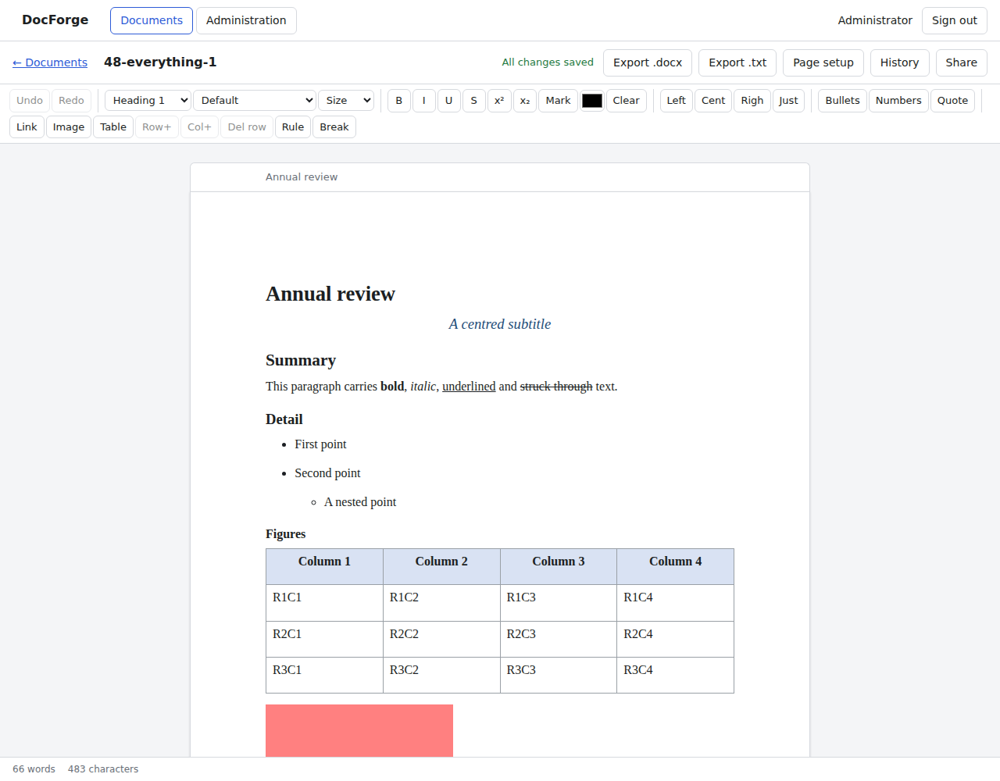
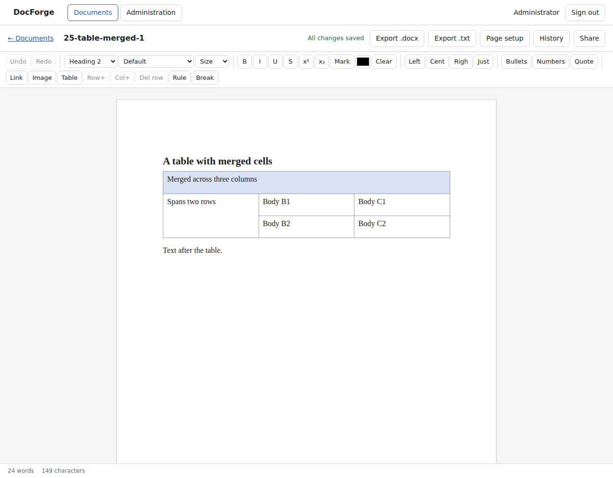
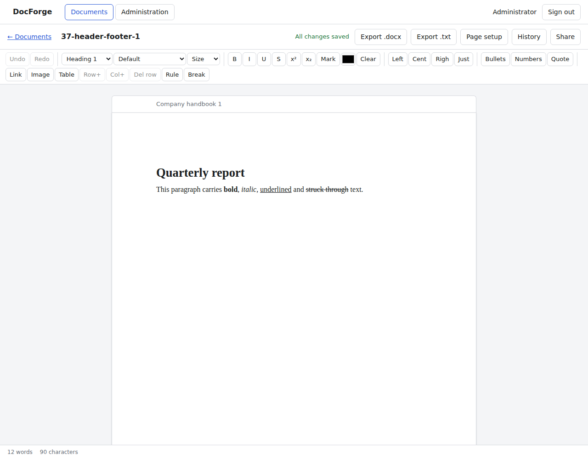
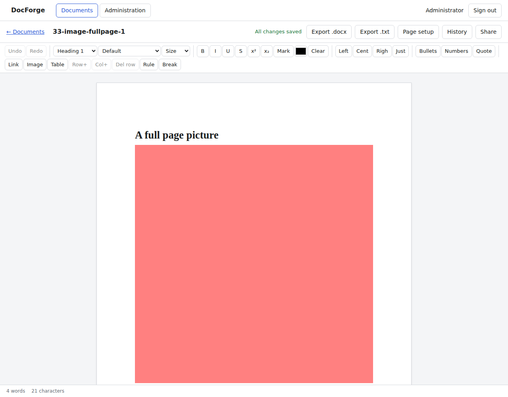

# Round-trip fidelity

How much of a Word document survives being uploaded, opened in the editor and
exported again. The harness is in `scripts/fidelity`:

```sh
npm run build
node scripts/fidelity/run.mjs            # upload, export and compare
node scripts/fidelity/run.mjs --shots    # and photograph each document
```

It generates the corpus, uploads each file to a running build, exports it again
and compares the two **as OOXML**, not as text. Every check counts items rather
than documents: a file with twelve coloured cells of which nine survive scores
nine of twelve. A feature a document never contained is not counted, so the
score cannot be flattered by documents with nothing to lose.

The corpus is generated rather than downloaded. An air-gapped build cannot fetch
anything, the licence of a document found on the web is rarely clear, and a
generated corpus covers every feature deliberately rather than by luck.


50 Word documents uploaded, exported and compared as OOXML on 2026-09-18.

**Overall: 100.0% of the measured items survived** (1260 of 1260).

## By feature

| Feature | Documents | Items | Preserved | Score |
|---|---:|---:|---:|---:|
| headings H1 to H4 | 49 | 73 | 73 | 100.0% |
| bold, italic, underline and strikethrough | 19 | 54 | 54 | 100.0% |
| named fonts and sizes | 8 | 26 | 26 | 100.0% |
| text | 50 | 685 | 685 | 100.0% |
| text colour and highlighting | 8 | 18 | 18 | 100.0% |
| left, centre, right and justified paragraphs | 8 | 15 | 15 | 100.0% |
| bulleted and numbered lists | 8 | 54 | 54 | 100.0% |
| tables | 14 | 231 | 231 | 100.0% |
| coloured table cells | 11 | 33 | 33 | 100.0% |
| merged table cells | 7 | 21 | 21 | 100.0% |
| inline images | 11 | 15 | 15 | 100.0% |
| a full-width image | 4 | 4 | 4 | 100.0% |
| page headers | 9 | 9 | 9 | 100.0% |
| page footers | 9 | 9 | 9 | 100.0% |
| landscape orientation | 3 | 3 | 3 | 100.0% |
| page breaks | 3 | 3 | 3 | 100.0% |
| block quotes | 5 | 5 | 5 | 100.0% |
| horizontal rules | 2 | 2 | 2 | 100.0% |

## By document

| Document | Score | Items | Notes |
|---|---:|---:|---|
| 01-headings-calibri | 100.0% | 25/25 |  |
| 02-headings-times-new-roman | 100.0% | 33/33 |  |
| 03-headings-arial | 100.0% | 25/25 |  |
| 04-headings-georgia | 100.0% | 25/25 |  |
| 05-headings-courier-new | 100.0% | 29/29 |  |
| 06-colour-1F4E79 | 100.0% | 13/13 |  |
| 07-colour-C00000 | 100.0% | 13/13 |  |
| 08-colour-375623 | 100.0% | 13/13 |  |
| 09-colour-7030A0 | 100.0% | 13/13 |  |
| 10-colour-BF8F00 | 100.0% | 13/13 |  |
| 11-align-left | 100.0% | 29/29 |  |
| 12-align-centre | 100.0% | 29/29 |  |
| 13-align-right | 100.0% | 29/29 |  |
| 14-align-justified | 100.0% | 29/29 |  |
| 15-align-mixed | 100.0% | 26/26 |  |
| 16-lists-1 | 100.0% | 19/19 |  |
| 17-lists-2 | 100.0% | 21/21 |  |
| 18-lists-3 | 100.0% | 23/23 |  |
| 19-lists-4 | 100.0% | 25/25 |  |
| 20-lists-5 | 100.0% | 27/27 |  |
| 21-table-plain-1 | 100.0% | 22/22 |  |
| 22-table-plain-2 | 100.0% | 31/31 |  |
| 23-table-plain-3 | 100.0% | 28/28 |  |
| 24-table-plain-4 | 100.0% | 39/39 |  |
| 25-table-merged-1 | 100.0% | 29/29 |  |
| 26-table-merged-2 | 100.0% | 29/29 |  |
| 27-table-merged-3 | 100.0% | 29/29 |  |
| 28-table-merged-4 | 100.0% | 29/29 |  |
| 29-image-inline-1 | 100.0% | 11/11 |  |
| 30-image-inline-2 | 100.0% | 11/11 |  |
| 31-image-inline-3 | 100.0% | 11/11 |  |
| 32-image-inline-4 | 100.0% | 11/11 |  |
| 33-image-fullpage-1 | 100.0% | 7/7 |  |
| 34-image-fullpage-2 | 100.0% | 7/7 |  |
| 35-image-fullpage-3 | 100.0% | 7/7 |  |
| 36-image-fullpage-4 | 100.0% | 7/7 |  |
| 37-header-footer-1 | 100.0% | 18/18 |  |
| 38-header-footer-2 | 100.0% | 18/18 |  |
| 39-header-footer-3 | 100.0% | 18/18 |  |
| 40-header-footer-4 | 100.0% | 18/18 |  |
| 41-header-footer-5 | 100.0% | 18/18 |  |
| 42-header-footer-6 | 100.0% | 18/18 |  |
| 43-layout-1 | 100.0% | 33/33 |  |
| 44-layout-2 | 100.0% | 33/33 |  |
| 45-layout-3 | 100.0% | 33/33 |  |
| 46-quote-rule-1 | 100.0% | 13/13 |  |
| 47-quote-rule-2 | 100.0% | 13/13 |  |
| 48-everything-1 | 100.0% | 86/86 |  |
| 49-everything-2 | 100.0% | 88/88 |  |
| 50-everything-3 | 100.0% | 86/86 |  |

## What is not measured

The number above is what the harness checks, and it is worth being plain about
what it leaves out.

- **Styles as named styles.** Direct formatting is preserved; a document's own
  named styles are read for headings and quotations and otherwise flattened
  into direct formatting.
- **Numbering definitions.** A list comes back as a list of the right kind, not
  with the source document's numbering scheme.
- **Fields, footnotes, comments, tracked changes, text boxes, shapes, charts,
  SmartArt and embedded objects.** None of these have a place in the model yet,
  so they are dropped rather than carried through.
- **Sections beyond the first**, different first-page or odd/even headers, and
  columns.
- **Anything a picture is anchored to.** Pictures come back inline, at the size
  they were shown at.

Each of those is a decision about scope rather than a defect, and each would be
measured the same way if it were added: as items, on the same corpus.

## What the documents look like

Four of the fifty, opened in the editor after upload.

| | |
|---|---|
|  |  |
|  |  |
